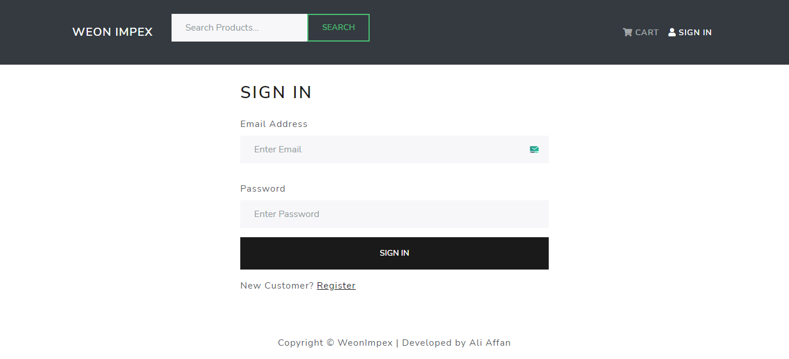
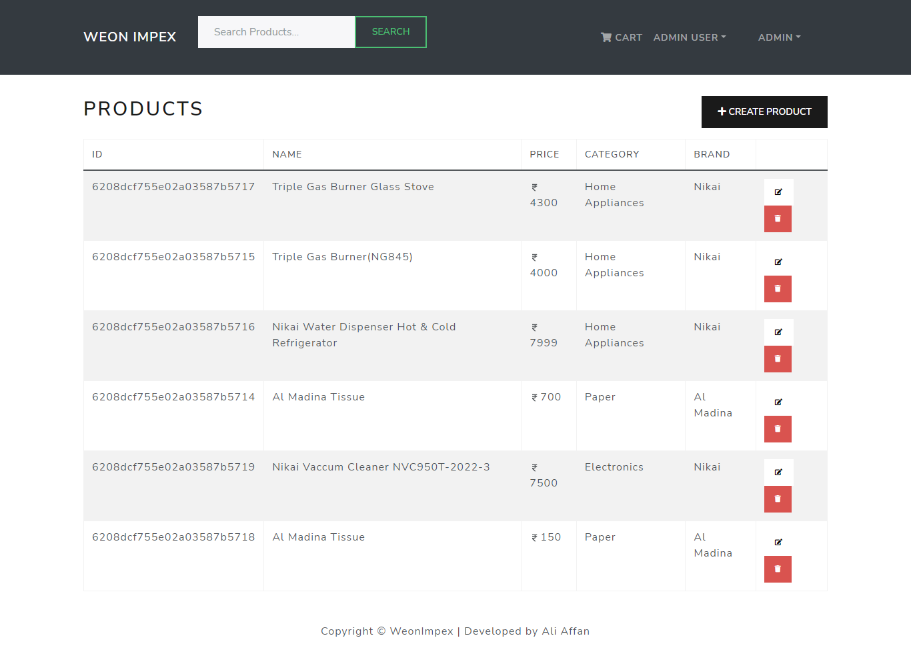
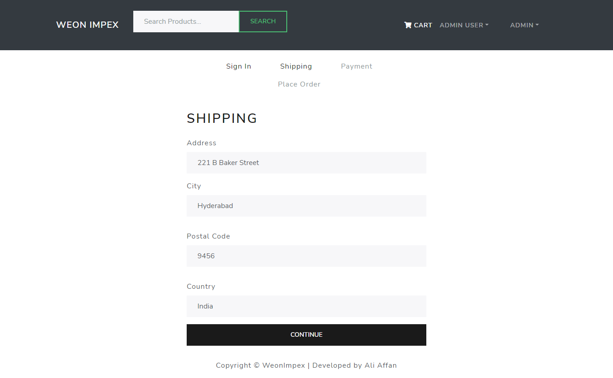
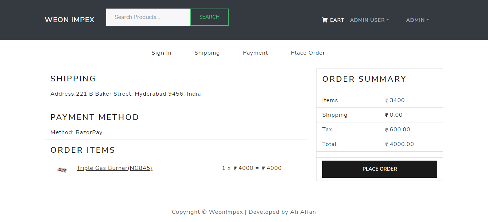
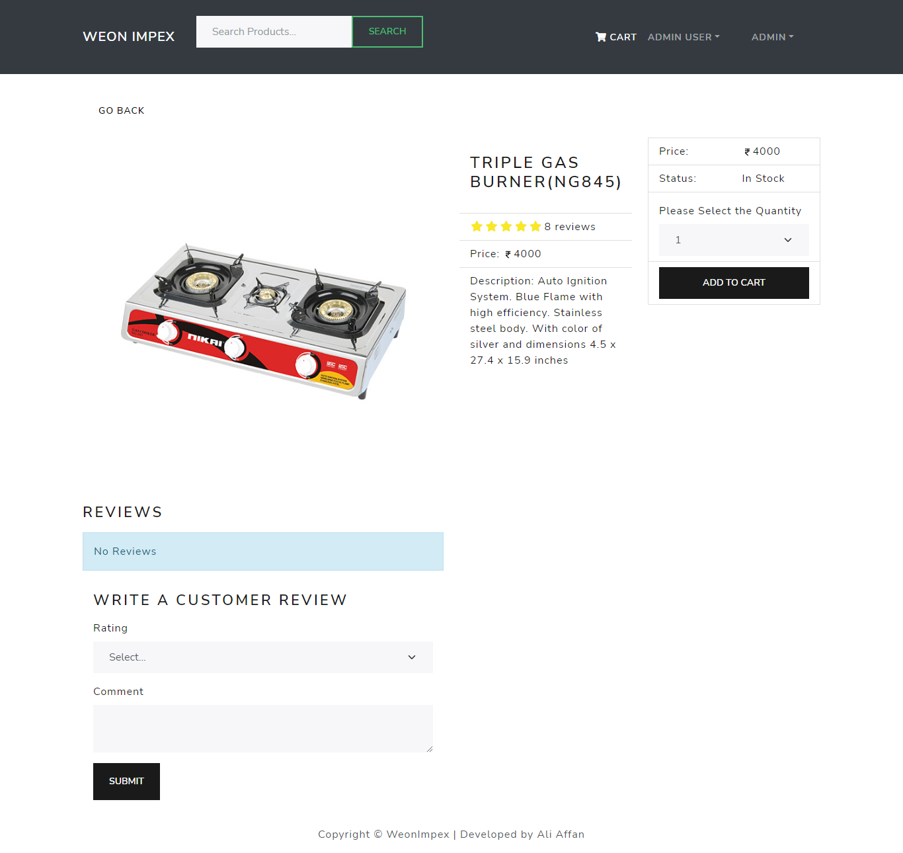
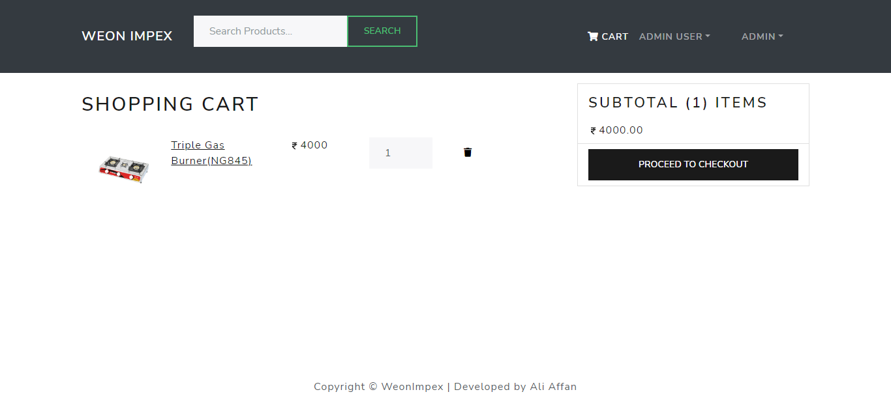
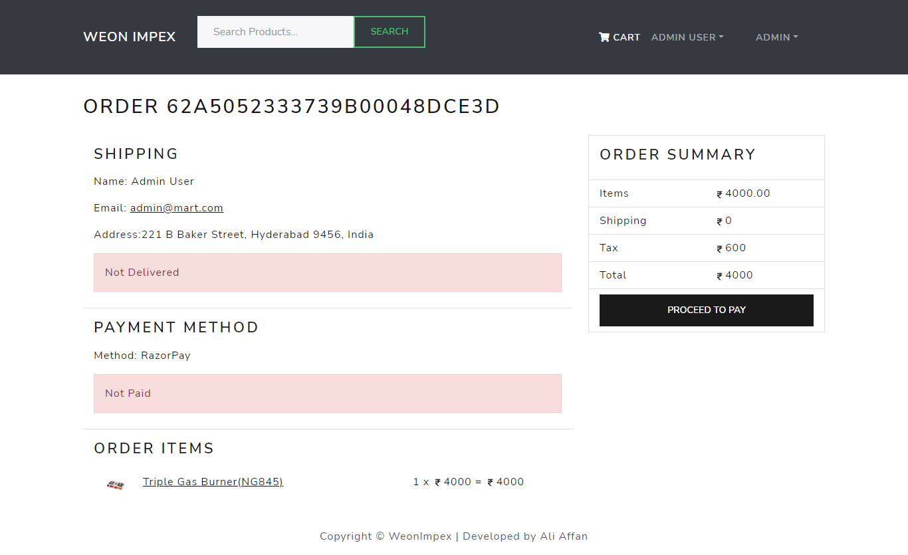
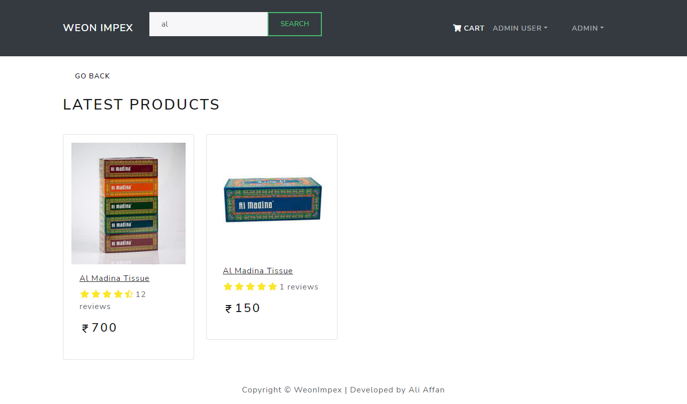
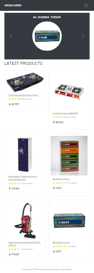
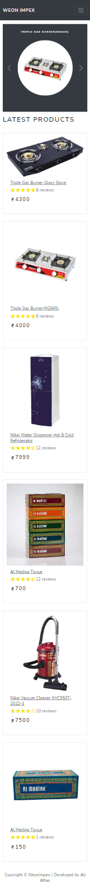

# WeonImpex
Self hosted e-commerce web application using MERN stack. Manage your local store and reach customer directly with this free to use, open source application
## Live Demo
Check out the application at: https://weonimpex.herokuapp.com/
### Features
***
* Authentication using JWT
* Site wide search
* Administrative Panel
* Payment Integration with Razorpay
* Customers can review products
* Site wide cart integration
* Check out the screenshots below
***

